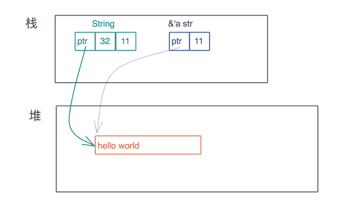

<!-- START doctoc generated TOC please keep comment here to allow auto update -->
<!-- DON'T EDIT THIS SECTION, INSTEAD RE-RUN doctoc TO UPDATE -->
**Table of Contents**  *generated with [DocToc](https://github.com/thlorenz/doctoc)*

- [指针](#%E6%8C%87%E9%92%88)
  - [共享引用指针 Shared references (&)](#%E5%85%B1%E4%BA%AB%E5%BC%95%E7%94%A8%E6%8C%87%E9%92%88-shared-references-)
  - [可变引用指针 Mutable references (&mut)](#%E5%8F%AF%E5%8F%98%E5%BC%95%E7%94%A8%E6%8C%87%E9%92%88-mutable-references-mut)
  - [裸指针 Raw pointers (*const and *mut)](#%E8%A3%B8%E6%8C%87%E9%92%88-raw-pointers-const-and-mut)
  - [智能指针 Smart Pointers](#%E6%99%BA%E8%83%BD%E6%8C%87%E9%92%88-smart-pointers)
    - [COW 写时克隆(Clone on write)的智能指针](#cow-%E5%86%99%E6%97%B6%E5%85%8B%E9%9A%86clone-on-write%E7%9A%84%E6%99%BA%E8%83%BD%E6%8C%87%E9%92%88)
      - [Cow的使用场景](#cow%E7%9A%84%E4%BD%BF%E7%94%A8%E5%9C%BA%E6%99%AF)
    - [MutexGuard](#mutexguard)

<!-- END doctoc generated TOC please keep comment here to allow auto update -->

# 指针

## 共享引用指针 Shared references (&)

- 共享引用指针指向的是一个值的内存地址；
- 当一个值存在共享引用指针的时候，同时也阻止了这个值的可变；
- Interior mutability 是一个特例，允许内部值可变；
- 一个值可以存在任意个共享引用指针；
- 共享引用指针语法： &type 或 &'a type (带生命周期标记) ；
- 共享引用指针的复制是 "shallow" 操作，只复制指针自身，也就是说共享引用指针是可复制的；
- 释放共享引用指针对共享引用指针所指向的值没有影响；
- 如果共享引用指针指向的是一个临时值( temporary value) ，共享引用指针和临时值在当前域中共存；

## 可变引用指针 Mutable references (&mut)

- 可变引用指针同样指向的是一个值的内存地址；
- 可变引用指针语法： &mut type or &'a mut type；
- 一个值的可变引用指针是访问这个值的唯一途径，所以可变引用指针不可以复制；

## 裸指针 Raw pointers (*const and *mut)

- 裸指针没有安全保证和值的有效性保证；
- 裸指针语法： *const T 或 *mut T，例如 *const i32 代表 对一个 32-bit 整数值的裸指针；
- 裸指针的复制和释放操作对它所指向的值的生命没有影响；
- 对裸指针的解引用操作 (&* or &mut *)是不安全操作( unsafe operation)；
- 对裸指针的解引用操作 (&* or &mut *)可以把一个裸指针转成共享引用或可变引用；
- 裸指针通常是不鼓励使用；
- 使用裸指针的场景有三种：为了方便 Rust 和其他语言的交互；对性能有更好要求的函数；实现底层函数。
- 当比较裸指针的时候，比较的是地址值、并不是对裸指针指向的值做比较；
- 当比较指向DST类型值的裸指针的时候，除了比较地址值，还同时比较辅助值；

## 智能指针 Smart Pointers

在 Rust 中，凡是需要做资源回收的数据结构，且实现了 Deref/DerefMut/Drop，都是智能指针。

智能指针是一个表现行为很像指针的数据结构，但除了指向数据的指针外，它还有元数据以提供额外的处理能力。

String 对堆上的值有所有权，而 &str 是没有所有权的，这是 Rust 中智能指针和普通胖指针的区别。
智能指针一定是一个胖指针，但胖指针不一定是一个智能指针。比如 &str 就只是一个胖指针，它有指向堆内存字符串的指针，同时还有关于字符串长度的元数据。



### COW 写时克隆(Clone on write)的智能指针

```rust
#[stable(feature = "rust1", since = "1.0.0")]
#[cfg_attr(not(test), rustc_diagnostic_item = "Cow")]
pub enum Cow<'a, B: ?Sized + 'a>
where
    B: ToOwned,
{
    /// Borrowed data.
    #[stable(feature = "rust1", since = "1.0.0")]
    Borrowed(#[stable(feature = "rust1", since = "1.0.0")] &'a B),

    /// Owned data.
    #[stable(feature = "rust1", since = "1.0.0")]
    Owned(#[stable(feature = "rust1", since = "1.0.0")] <B as ToOwned>::Owned),
}
```

是一个enum，包含一个对类型B的只读引用，或者包含一个拥有类型B的所有权的数据。 使用Cow使我们在返回数据时提供了两种可能:
要么返回一个借用的数据(只读)，要么返回一个拥有所有权的数据(可读写)。

ToOwned 解释

```rust
#[cfg_attr(not(test), rustc_diagnostic_item = "ToOwned")]
#[stable(feature = "rust1", since = "1.0.0")]
pub trait ToOwned {
    /// The resulting type after obtaining ownership.
    #[stable(feature = "rust1", since = "1.0.0")]
    type Owned: Borrow<Self>;


    #[stable(feature = "rust1", since = "1.0.0")]
    #[must_use = "cloning is often expensive and is not expected to have side effects"]
    #[cfg_attr(not(test), rustc_diagnostic_item = "to_owned_method")]
    fn to_owned(&self) -> Self::Owned;

    #[stable(feature = "toowned_clone_into", since = "1.63.0")]
    fn clone_into(&self, target: &mut Self::Owned) {
        *target = self.to_owned();
    }
}
```

str 对 ToOwned trait 的实现

```rust
impl ToOwned for str {
    type Owned = String;
    #[inline]
    fn to_owned(&self) -> String {
        unsafe { String::from_utf8_unchecked(self.as_bytes().to_owned()) }
    }

    fn clone_into(&self, target: &mut String) {
        let mut b = mem::take(target).into_bytes();
        self.as_bytes().clone_into(&mut b);
        *target = unsafe { String::from_utf8_unchecked(b) }
    }
}
```

String 要实现 Borrow

```rust
impl Borrow<str> for String {
    #[inline]
    fn borrow(&self) -> &str {
        &self[..]
    }
}
```

#### Cow的使用场景

使用Cow主要用来减少内存的分配和复制，因为绝大多数的场景都是读多写少。使用Cow可以在需要些的时候才做一次内存复制，这样就很大程度减少了内存复制次数

```rust
use std::borrow::Cow;

const SENSITIVE_WORD: &str = "bad";

fn remove_sensitive_word<'a>(words: &'a str) -> Cow<'a, str> {
    if words.contains(SENSITIVE_WORD) {
        Cow::Owned(words.replace(SENSITIVE_WORD, ""))
    } else {
        Cow::Borrowed(words)
    }
}

fn remove_sensitive_word_old(words: &str) -> String {
    if words.contains(SENSITIVE_WORD) {
        words.replace(SENSITIVE_WORD, "")
    } else {
        words.to_owned()
    }
}

fn main() {
    let words = "I'm a bad boy.";
    let new_words = remove_sensitive_word(words);
    println!("{}", new_words);

    let new_words = remove_sensitive_word_old(words);
    println!("{}", new_words);
}
```

remove_sensitive_word和remove_sensitive_word_old两种实现，前者的返回值使用了Cow，后者返回值使用的是String。
仔细分析一下，很明显前者的实现效率更高。
因为如果输入的字符串中没有敏感词时，前者Cow::Borrowed(words)不会发生堆内存的分配和拷贝，后者words.to_owned()
会发生一次堆内存的分配和拷贝。

### MutexGuard

不但通过 Deref 提供良好的用户体验，还通过 Drop trait 来确保，使用到的内存以外的资源在退出时进行释放。
