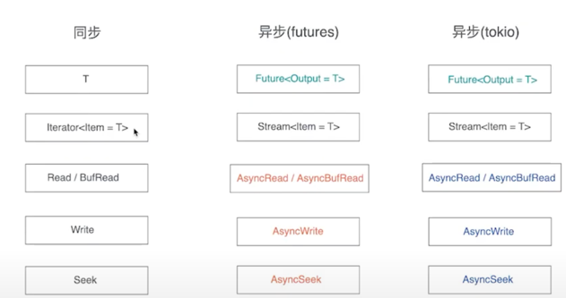

<!-- START doctoc generated TOC please keep comment here to allow auto update -->
<!-- DON'T EDIT THIS SECTION, INSTEAD RE-RUN doctoc TO UPDATE -->
**Table of Contents**  *generated with [DocToc](https://github.com/thlorenz/doctoc)*

- [基于 Send 和 Sync 的线程安全](#%E5%9F%BA%E4%BA%8E-send-%E5%92%8C-sync-%E7%9A%84%E7%BA%BF%E7%A8%8B%E5%AE%89%E5%85%A8)
- [线程同步](#%E7%BA%BF%E7%A8%8B%E5%90%8C%E6%AD%A5)
- [同步 trait vs 异步 trait](#%E5%90%8C%E6%AD%A5-trait-vs-%E5%BC%82%E6%AD%A5-trait)
- [异步运行时](#%E5%BC%82%E6%AD%A5%E8%BF%90%E8%A1%8C%E6%97%B6)
  - [executor](#executor)

<!-- END doctoc generated TOC please keep comment here to allow auto update -->

## 基于 Send 和 Sync 的线程安全

Send和Sync是 Rust 安全并发的重中之重，但是实际上它们只是标记特征(marker trait，该特征未定义任何行为，因此非常适合用于标记),
来看看它们的作用：

- 实现Send的类型可以在线程间安全的传递其所有权
- 实现Sync的类型可以在线程间安全的共享(通过引用)

## 线程同步

- 共享内存
    - atomics
    - 线程间共享只读数据 Arc<T>
    - 线程间共享可写数据 Arc<Mutex<T>>
- CSP: channel
    - mpsc
    - oneshot
- Actor

## 同步 trait vs 异步 trait

## 异步运行时

- reactor 会利用操作系统提供的异步 I/O，比如 epoll / kqueue / IOCP，来监听操作系统提供的 IO 事件，当遇到满足条件的事件时，就会调用
  Waker.wake() 唤醒被挂起的 Future。这个 Future 会回到 ready queue 等待执行
- executor 用于调度和执行相应的任务( Future ): tokio 的调度器（executor）会运行在多个线程上，运行线程自己的 ready queue
  上的任务（Future），如果没有，就去别的线程的调度器上“偷”一些过来运行。当某个任务无法再继续取得进展，此时 Future 运行的结果是
  Poll::Pending，那么调度器会挂起任务，并设置好合适的唤醒条件（Waker），等待被 reactor 唤醒。

异步编程依赖于两个关键概念：Future 和 async/await

### executor

executor 大致想象成一个 Future 的调度器。

常见的 executor 有：

- futures 库自带的很简单的 executor
- tokio 提供的 executor，当使用 #[tokio::main] 时，就隐含引入了 tokio 的 executor；
- async-std 提供的 executor，和 tokio 类似；
- smol 提供的 async-executor，主要提供了 block_on